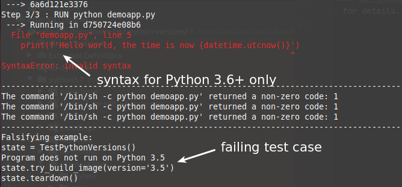

# hypothesis-test-python-versions (Hypothesis example)

This project demonstrates how to confirm a program runs on Python versions that you expect using the Hypothesis library.

## Why
This won't inherently serve as a practical use case. It's to demonstrate stateful testing with Hypothesis. Having the ability to run tests against **any command** , whether target program is written in Python or not is a very powerful feature. Stateful testing works as long as you can observe a pass or a failure in Python.

## Requirements

This demo needs Docker, Hypothesis and pytest installed. Using [pipenv](https://github.com/pypa/pipenv), run `pipenv run pytest`

## What it does
It runs the `demoapp.py` script against different versions of Python in Docker. This is basically a sanity check to confirm the script runs successfully. You should then see a failing case with 3.5 (because demo uses [f-strings](https://www.python.org/dev/peps/pep-0498/) which works on 3.6+ only):

# Copyright
2020 Jeshan G. BABOOA

Code is released under the simplified BSD licence. See [LICENCE](LICENCE) file for details.
